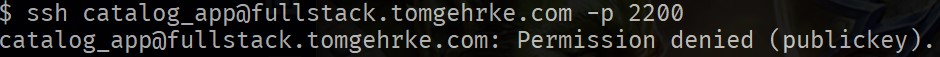
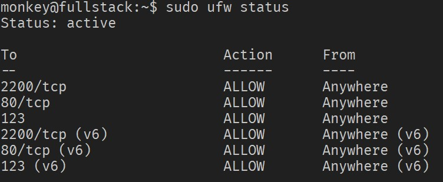
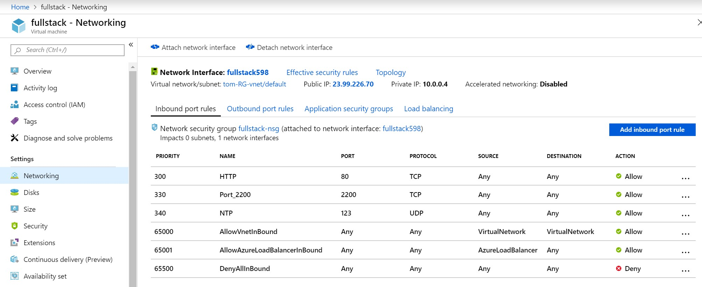
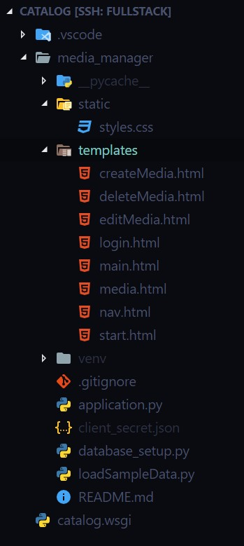
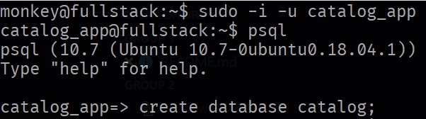
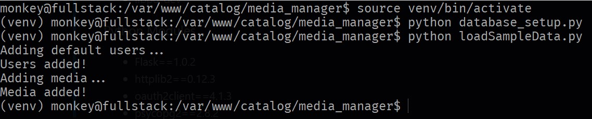
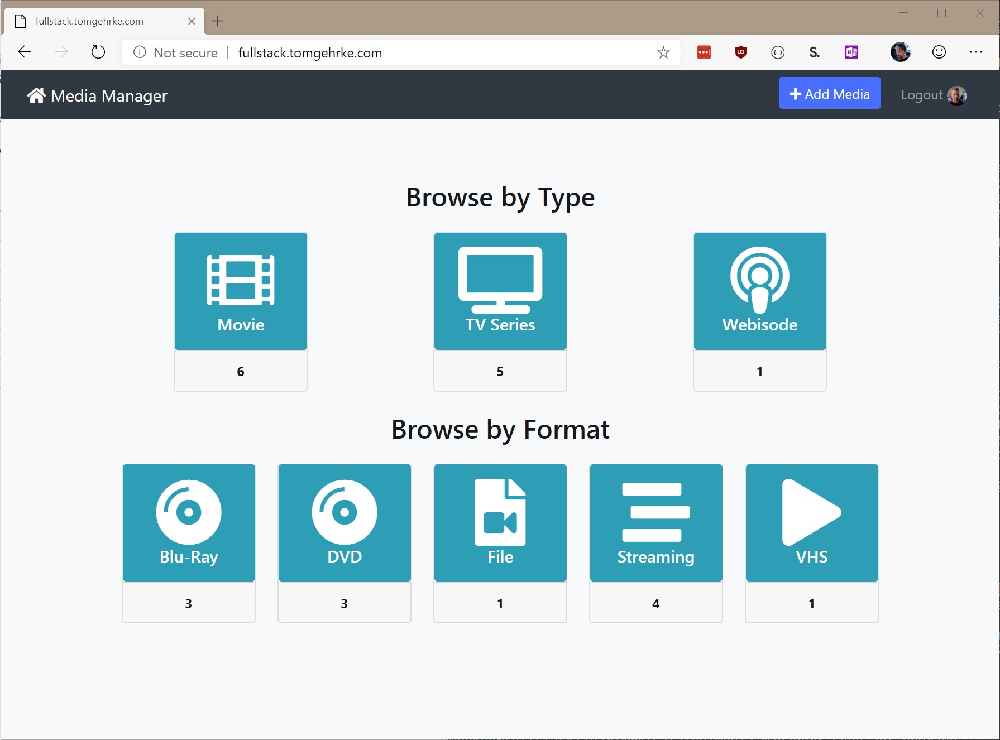
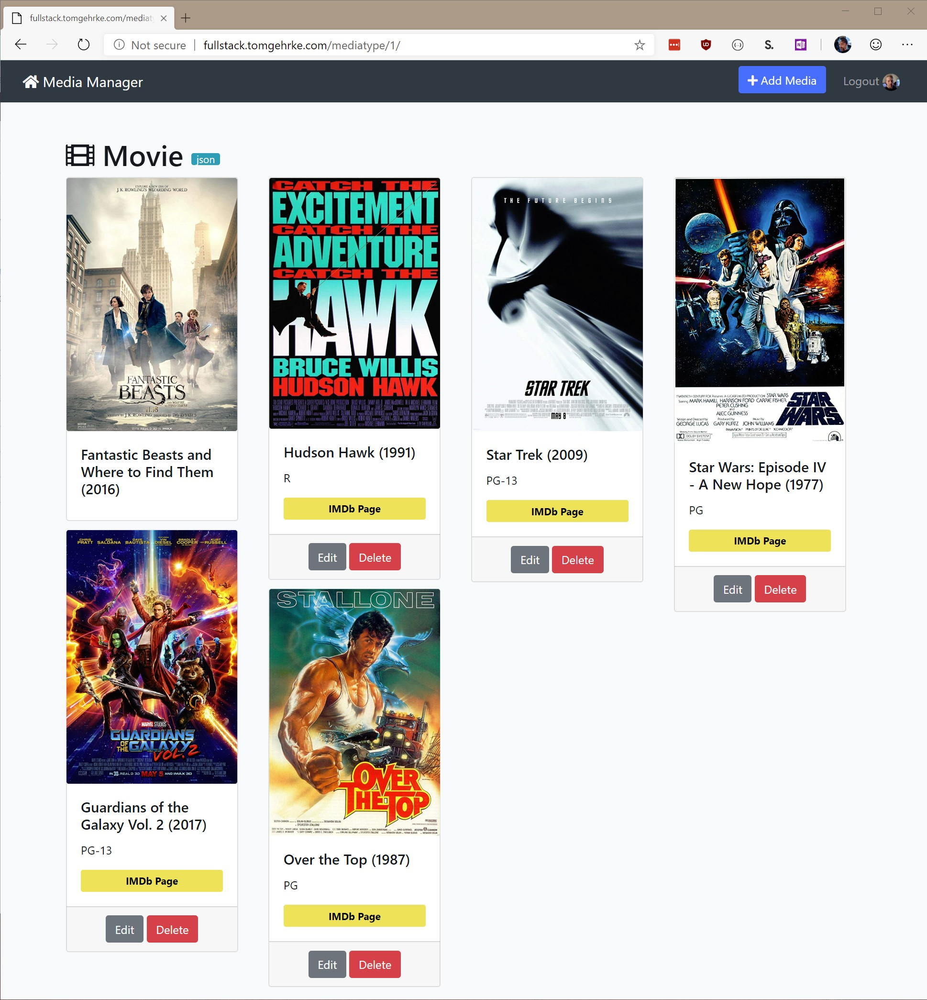
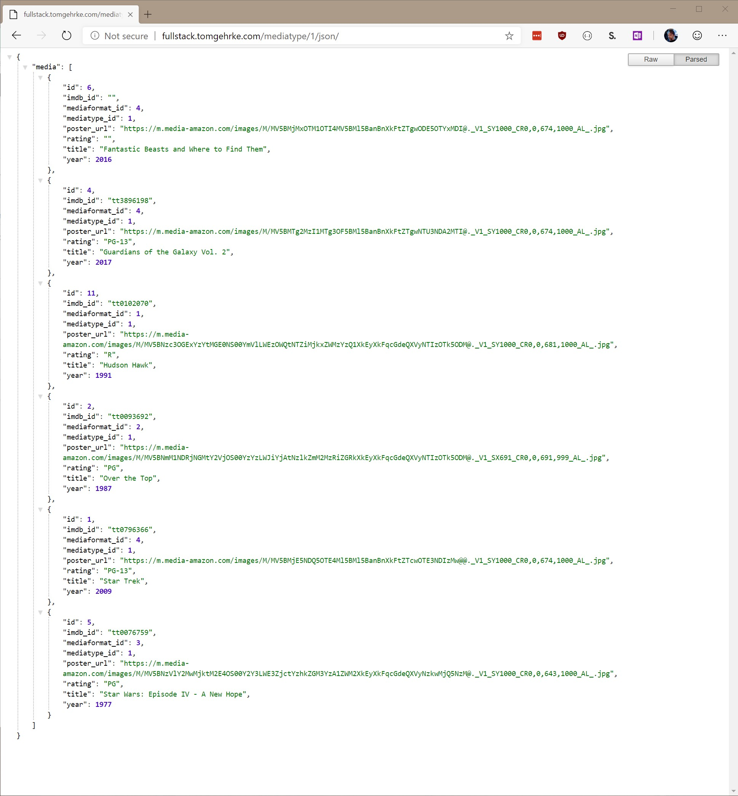

# Udacity Full Stack Web Developer Final Project

## Basic Information

* IP Address: 23.99.226.70
* Hostname: fullstack.tomgehrke.com
* SSH Port: 2200

## Configuration

### SSH

The following changes were made to the server's SSH configuration (/etc/ssh/sshd_config):

* Port 2200
* PermitRootLogin no
* PasswordAuthentication no

Because password authentication is disabled, a key is required. Attempts to authenticate without a key will be denied.



## Security

### User Accounts

* monkey - Primary (student) account
* grader - Mentor account (sudo access granted)
* catalog_app - Account for database access

### Networking

By default, both the local firewall (UFW) and the Azure instance denies incoming traffic. There are, however, three exceptions.

Access has been granted on the following ports:

* Port 80 - HTTP
* Port 123 - NTP
* Port 2200 - for (non-standard) SSH access


*UFW status*


*Azure inbound port rules*

### Database

A catalog_app psql role was created with the rights to create the application database.

```bash
postgres@fullstack:~$ createuser --interactive --pwprompt
Enter name of role to add: catalog_app
...
Shall the new role be a superuser? (y/n) n
Shall the new role be allowed to create databases? (y/n) y
Shall the new role be allowed to create more new roles? (y/n) n
```

### Files

The application files have been placed in `/var/www/catalog`. Rights to this folder are as follows:


## Supporting Software

The following software has been installed:

### System Software

* python3-pip
* apache2
* libapache2-mod-wsgi-py3
* postgresql
* libpq-dev

### Python Modules

* Flask==1.0.2
* httplib2==0.12.3
* oauth2client==4.1.3
* psycopg2==2.8.2
* requests==2.21.0
* SQLAlchemy==1.3.3

## Configuration

### Application Files


*Filesystem structure*

### Apache Server

The server was configured to serve requests on port 80 and a Web Server
Gateway Interface (WSGI) was established to pass requests off to the
Python application.

### Database

The catalog database was created manually by using the *catalog_app* account.


*Creating the database*

The tables were then created and test data preloaded by issuing the following
commands:


*Database initialization commands*

## Third-Party Resources

* Hover (DNS)
* Azure (virtual infrastructure)

## Screenshots


*Dashboard*


*Category Listing*


*Category JSON*